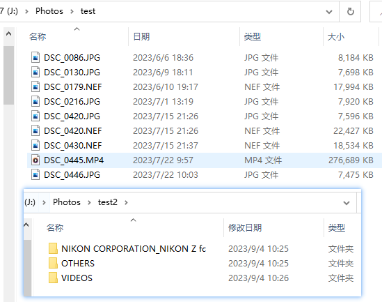

# Photo_Sorting_on_Time

基于拍摄时间的照片分类程序。

# 编写此脚本的心路历程

随着手机和数码相机的普及，我们每天都会拍摄大量的照片。然而，随之而来的是照片整理成了一个非常耗时且繁琐的任务。为了应对这个问题，我决定动手编写一个Python脚本来自动化照片整理过程。这个脚本能够根据照片的拍摄日期和时间信息，自动将它们按照年份、月份进行分类存储。通过这个自动化的照片整理程序，我不仅节省了大量的时间和精力，还可以轻松地浏览和管理我的照片收藏。让我告诉你，这个脚本真的是我的救星！

# 脚本功能实现思路

一、用pillow库对照片中的exif信息进行解析，得到设备信息和照片拍摄日期

二、用os.path检查和创建文件夹

三、用shutil库复制文件

# 程序的使用

一、使用vscode打开脚本，修改main.py文件中rootdir（照片初始目录）和outdir（分类后照片目录）参数
eg:

rootdir = "J:\\Photos\\test"

outdir = "J:\\Photos\\test2"

二、运行脚本

可以使用vscode的python插件，也可以通过命令行直接运行。

三、执行结果示例

# 脚本目前不足

一、不支持对NEF格式照片进行分类。

# TODO

一、支持NEF格式照片的exif信息读取，以及按时间分类
